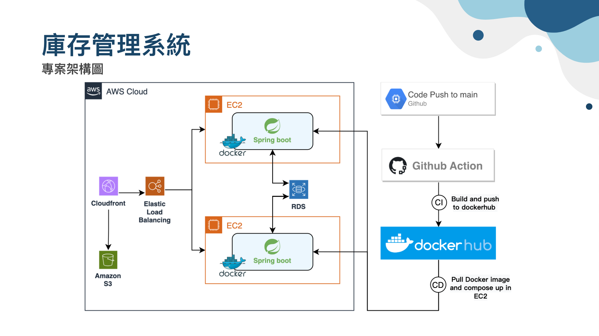
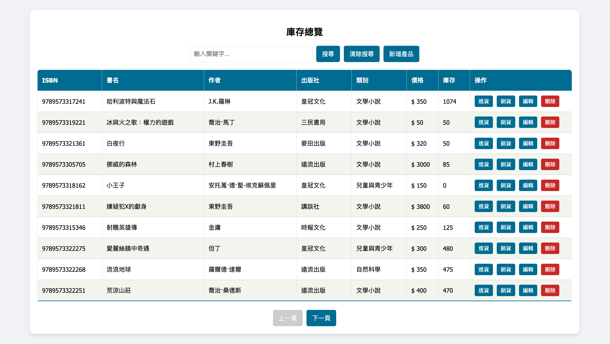

# Wits-Project-Inventory-Management

A system designed to manage book inventory and transaction records, improving inventory management efficiency
- Deployed the system with Docker and automated CI/CD using GitHub Actions
- Utilized AWS Elastic Load Balancing to improve system reliability
- Implemented CRUD operations for products and transactions, utilizing AWS RDS for efficient data management
- Applied Spring Boot Security and JWT for user validation

